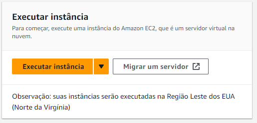

# Amazon EC2

O Amazon Elastic Compute Cloud (Amazon EC2) oferece uma capacidade de computação escalável sob demanda na Nuvem Amazon Web Services (AWS). O uso do Amazon EC2 reduz os custos de hardware para que você possa desenvolver e implantar aplicações com mais rapidez.

É possível usar o Amazon EC2 para executar quantos servidores virtuais forem necessários, configurar a segurança e as redes e gerenciar o armazenamento. Você pode adicionar capacidade (aumentar a escala verticalmente) para lidar com tarefas de computação pesada, como processos mensais ou anuais ou picos no tráfego do site. Quando o uso diminui, você pode reduzir a capacidade (reduzir a escala verticalmente) de novo.

### Criando uma EC2

Para criar uma EC2, navegue no console e busque pelo serviço EC2, e clique em <b>Executar instância</b>

Onde você poderá escolher o tipo e S.O, lembrando que o nivel gratuito é mais limitado em recurso.

- Defina um nome para sua EC2
- Escolha o S.O(Amazon Linux, Linux Ubuntu, MacOs, Window Server,etc)
- Escolha o tipo, a mais comum em nivel gratuito é a <b>t2.micro</b>, cade tipo possiu recursos diferentes, quanto a CPU, RAM, Armazenamento, etc.
- Crie um par de chaves, para conexões via SSH
- Configure a rede, ou pode optar em deixar tudo no padrão e alterar depois
- Por fim, clique em <b>Executar Instância</b>

Aguarde uns segundos, e pronto, sua EC2 esta disponivel para uso!

<i>Mais informações <a href="https://docs.aws.amazon.com/pt_br/AWSEC2/latest/UserGuide/concepts.html">aqui</a> .